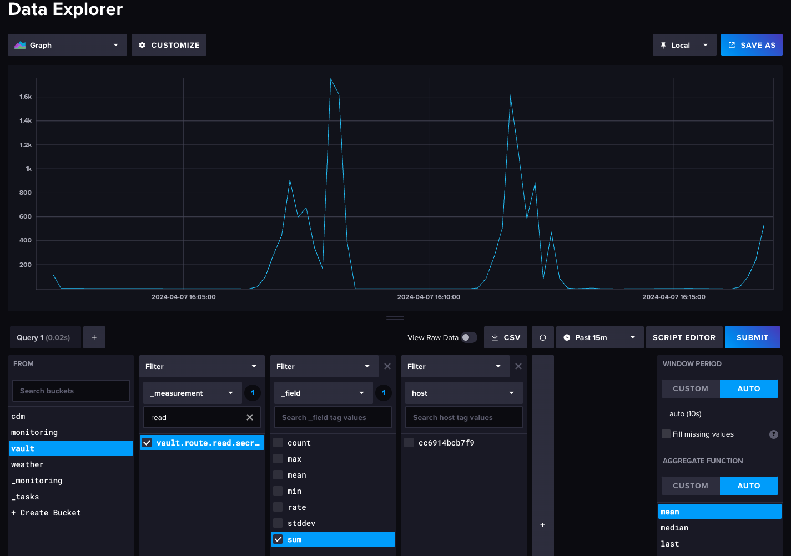

# monitoring-lab

A docker lab for testing applications

## 💬 About this project


Starting the lab sets up the following:

1. Influxdb, with 4 buckets.
    1. cdm (cpu/disk/memory)
    2. weather (fake weather data)
    3. vault (hashicorp vault)
    4. monitoring (future use)
2. Telegraf
    1. outputs to InfluxDB
    2. inputs for cdm/system data
    3. inputs for Hashicorp Vault data
3. Grafana, with an integration to Influxdb
4. Hashicorp Vault
5. A custom rust application that writes fake weather data into Influxdb
6. A custom go application that load tests Vault (and the performance data is logged to Influxdb via the Telegraf input)
7. A custom python application that runs Playwright to do synthetic monitoring of some of the applications.
8. Prometheus, using the blackbox_exporter to check HTTP status on a few endpoints
9. Unleash, for feature flags

## ⚠️ Warning

This lab sets up insecure secrets that are in plain text in the configurations.  These are not meant for production use.  Use at your own risk.

## 🤝 Dependencies

- docker
- docker-compose

## ⏩ Quickstart

`make build`

## 👍 Supported applications

- InfluxDB v2: http://localhost:8086 | username=admin, password=admin123456, token=AnInsecureTokenYouShouldProbablyChangeThis
- Telegraf
- Grafana: http://localhost:3000 | username=admin, password=admin123456
- Prometheus: http://localhost:9090
- Unleash: http://localhost:4242 | username=admin, password=admin123456

## 🤙 Custom applications

- rust-weather-app
- vault-load-test (Go)
- python-synthetic-monitoring


## 🎦 Examples

### Weather Data


### Vault Load Test


### Synthetic Monitoring


### InfluxDB Vault Reads


### InfluxDB CDM


### InfluxDB Weather


### Prometheus

These inputs are created with the blackbox_exporter config.


### Grafana Datasources

These datasources are automatically created and ready to use on dashboards.


### Grafana Prometheus Data


### Grafana Dashboard

This dashboard is automatically created with [configurations/grafana/provisioning/dashboards/example.json](configurations/grafana/provisioning/dashboards/example.json).


### Unleash: Feature Toggles


## 👨‍💻 Configure

### Set up a new influxdb bucket

1. Edit [configurations/influxdb/scripts/create_buckets.sh](configurations/influxdb/scripts/create_buckets.sh)
2. Add a new `influx bucket create` command for the organization you are using (e.g. `influx bucket create -n my_new_bucket -o sre -r 0`)
3. Run `make rebuild`


### Enable Feature Flags

The Hashicorp Vault load testing starts behind a feature flag that doesn't exist.  To enable it:

1. Navigate to http://localhost:4242.  This is the Unleash application to handle feature toggles.
2. Log in with admin/admin123456
3. Click the ⬆️ import button, and upload the feature toggle file: [configurations/unleash/feature_toggles.json](configurations/unleash/feature_toggles.json)
4. Once this is done, you should have new toggles called: `load_test_hashicorp_vault` and `weather_data`.  Toggle on "development" to enable a feature.

Soon you should start to see the logs for go-load-test-vault and rust-weather-app change from a disabled to an enabled state.  Example:

go-load-test-vault

```
2024-04-13 09:28:51 Counted 'load_test_hashicorp_vault'  as enabled? false
2024-04-13 09:28:52 Counted 'load_test_hashicorp_vault'  as enabled? false
2024-04-13 09:28:52 Sent: {AppName:default InstanceID:root-bc2a9fde27c0 Bucket:{Start:2024-04-13 15:27:52.759742462 +0000 UTC m=+0.001418917 Stop:2024-04-13 15:28:52.764467129 +0000 UTC m=+60.007545695 Toggles:map[load_test_hashicorp_vault:{Yes:0 No:55 Variants:map[]}]}}
2024-04-13 09:28:53 Testing with 10 concurrent requests.
2024-04-13 09:28:53 Counted 'load_test_hashicorp_vault'  as enabled? true
2024-04-13 09:28:53 Average latency: 4.243799ms, Error rate: 0%
2024-04-13 09:28:53 PID Adjustment: 2.35 (P: 1, I: 0.6, D: 0.75)
2024-04-13 09:28:54 Testing with 12 concurrent requests.
2024-04-13 09:28:54 Counted 'load_test_hashicorp_vault'  as enabled? true
2024-04-13 09:28:54 Average latency: 11.536913ms, Error rate: 0%
2024-04-13 09:28:54 PID Adjustment: 2.2 (P: 1, I: 1.2, D: 0)
```

rust-weather-app

```
2024-04-13 11:05:06 Feature 'weather_data' is disabled.
2024-04-13 11:05:16 Feature 'weather_data' is disabled.
2024-04-13 11:05:26 Feature 'weather_data' is enabled.
2024-04-13 11:05:26 [WeatherData { zip_code: 10001, temperature: 50.02940343865914, humidity: 31, time: 1713027926375068047 }]
2024-04-13 11:05:36 Feature 'weather_data' is enabled.
2024-04-13 11:05:36 [WeatherData { zip_code: 10001, temperature: 74.10098958329334, humidity: 41, time: 1713027936420729843 }]
```
