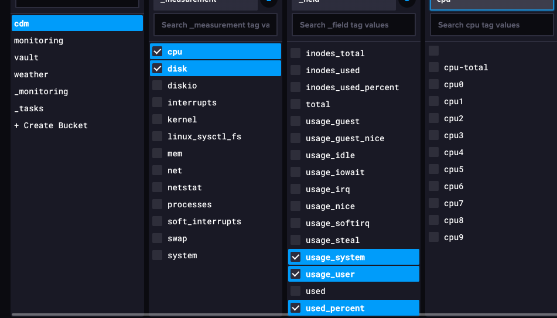

# monitoring-lab

A docker lab for testing applications

## About this project

Starting the lab sets up the following:

1. Influxdb, with 4 buckets.
    1. cdm (cpu/disk/memory)
    2. weather (fake weather data)
    3. vault (hashicorp vault)
    4. monitoring (future use)
2. Telegraf
    1. outputs to InfluxDB
    2. inputs for cdm/system data
    3. inputs for Hashicorp Vault data
3. Grafana, with an integration to Influxdb
4. Hashicorp Vault
5. A custom rust application that writes fake weather data into Influxdb
6. A custom go application that load tests Vault (and the performance data is logged to Influxdb via the Telegraf input)
7. Prometheus, using the blackbox_exporter to check HTTP status on a few endpoints

## Warning

This lab sets up insecure secrets that are in plain text in the configurations.  These are not meant for production use.  Use at your own risk.

## Dependencies

- docker
- docker-compose

## Quickstart

`make build`

## Supported applications

- InfluxDB v2: http://localhost:8086 | username=admin, password=admin123456, token=AnInsecureTokenYouShouldProbablyChangeThis
- Telegraf
- Grafana: http://localhost:3000 | username=admin, password=admin123456
- Prometheus: http://localhost:9090

## Custom applications

- rust-weather-app
- vault-load-test (Go)

## Examples

### Weather Data

### Vault Load Test

### InfluxDB Vault Reads

### InfluxDB CDM

### InfluxDB Weather

### Prometheus

These inputs are created with the blackbox_exporter config.

### Grafana Datasources

These datasources are automatically created and ready to use on dashboards.

### Grafana Prometheus Data

### Grafana Dashboard

This dashboard is automatically created with [configurations/grafana/provisioning/dashboards/example.json](configurations/grafana/provisioning/dashboards/example.json).

